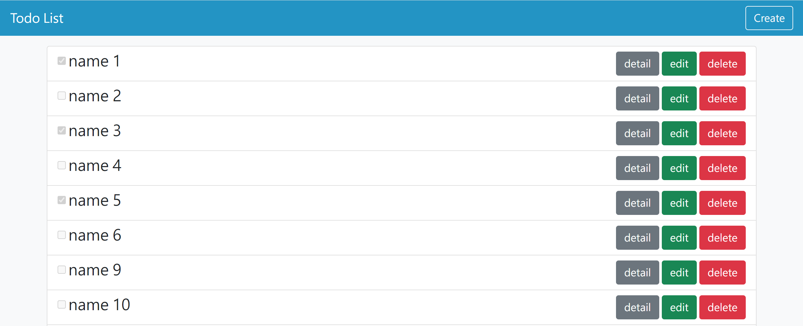

# todo list



## 介紹

備忘清單

### 功能

- 查看代辦事項
- 確認代辦事項
- 新增代辦事項
- 編輯代辦事項
- 刪除代辦事項

## 開始使用

1. 請先確認有安裝 node.js 與 npm
2. 將專案 clone 到本地
3. 在本地開啟之後，透過終端機進入資料夾，輸入：

   ```bash
   npm install
   ```

4. 安裝完畢後，繼續輸入：

   ```bash
   npm run start
   ```

5. 若看見此行訊息則代表順利運行，打開瀏覽器進入到以下網址

   ```bash
   Listening on http://localhost:3000
   ```

6. 若欲暫停使用

   ```bash
   ctrl + c
   ```

## 開發工具

- Node.js 18.16.0
- Express 4.18.2
- Express-Handlebars 4.0.2
- Bootstrap 5.2.1
- body-parser 1.20.2
- method-override 3.0.0
- mongoose 5.9.7
